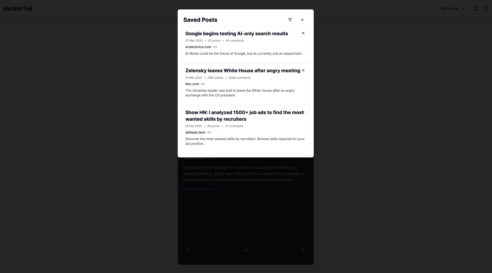
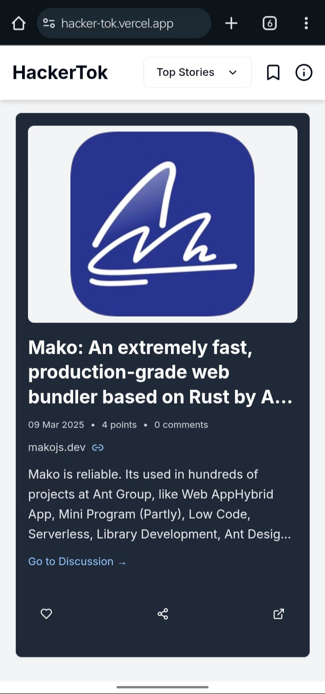

# **HackerTok** 
*A TikTok-style web interface for browsing Hacker News stories*  

## **Overview**  
HackerTok is a modern, **TikTok-style web application** that allows users to browse **Hacker News stories**. The app is built with **Next.js**, **React**, **TailwindCSS**, and it uses the Hacker News API to fetch the latest tech news. To ensure fast, reliable performance, HackerTok implements caching and optimization strategies using Redis.

**Features:**  
- Infinite scrolling with **smooth snap navigation**  
- Story cards with images, descriptions, and metadata  
- Like & save your favorite stories **(stored in localStorage)**  
- **Fast & optimized API** with caching  using Redis for **low latency**
- Lazy loading **story metadata** (images, descriptions, favicons)  
- Category-based filtering (**Top, New, Best, Ask, Show, Job**)  
- Responsive **mobile-first UI**  

---

## **Demo**  
**Live Deployment**: [HackerTok on Vercel](https://hacker-tok.vercel.app) 

---

## Screenshots


*HackerTok home screen with story cards.*


*HackerTok Saved Posts*

 

*Responsive mobile view of HackerTok.*

---

## **Tech Stack**  
- **Core:** Next.js, TailwindCSS, TypeScript, Cheerio for metadata extraction
- **Caching & Optimization:** Redis for reducing external API calls and latency
- **Data Source:** [Hacker News API](https://github.com/HackerNews/API)  
- **Deployment:** Vercel  

---

## **Installation & Setup**  
### **1.Clone the Repository**  
```sh
git clone https://github.com/your-username/hackertok.git
cd hackertok
```

### **2.Install Dependencies**  
```sh
npm install
# or
yarn install
```

### **3.Run the Development Server**  
```sh
npm run dev
# or
yarn dev
```
Open **`http://localhost:3000`** in your browser.  

---

## **Folder Structure**  
```
HackerTok/
│── public/                          # Static assets (favicons, placeholder images, etc.)
│── src/
│   ├── app/                         # Next.js application pages & routes
│   │   ├── api/                     # API route handlers (server-side logic)
│   │   │   ├── stories/             # API for fetching Hacker News stories
│   │   ├── layout.tsx               # Global layout component
│   │   ├── page.tsx                 # Main page with infinite scrolling & story feed
|   |   ├── globals.css              # Global CSS styles
│   ├── components/                  # UI Components
│   │   ├── StoryCard.tsx            # Displays individual stories
│   │   ├── CategoryFilter.tsx       # Dropdown to filter story categories
│   │   ├── SavedPosts.tsx           # Modal for saved posts
│   │   ├── AboutOverlay.tsx         # Info popup about HackerTok
│   │   ├── ui/                      # Reusable UI elements (buttons, modals, etc.)
│   ├── hooks/                       # Custom hooks (e.g., use-toast for notifications)
│   ├── lib/                         # Utility functions & API calls
│   │   ├── api.ts                   # Fetch stories from API
│   │   ├── types.ts                 # TypeScript type definitions
│   │   ├── utils.ts                 # Helper functions (date formatting, domain extraction, etc.)
│   ├── styles/                      # Global & component-specific styles
│   ├── app/
│── next.config.js                   # Next.js configuration
│── tailwind.config.js               # Tailwind CSS configuration
│── tsconfig.json                    # TypeScript configuration
│── package.json                     # Project dependencies & scripts
│── README.md                        # Project documentation

```

---

## **API Optimization**  
HackerTok uses an optimized **Next.js API** to fetch Hacker News stories efficiently.  
- Uses **in-memory caching** to reduce API calls  
- **Lazy-loads metadata** (images, favicons) 
- Implements **error handling & fallback UI** for failed requests

To deliver a snappy user experience and reduce latency, HackerTok uses Redis for caching at multiple levels:

- Story IDs Cache:
Cached for 10–15 minutes to reduce repeated calls to the Hacker News API. This minimizes the load on the API while keeping the data reasonably fresh.

- Full Story Cache:
Each story (including metadata) is cached for 15 minutes. This ensures that once a story is fetched and processed, subsequent requests are served instantly from Redis.

- Metadata & Favicon Cache:
Metadata (image and description) and favicons are cached for 12 hours since they rarely change. This dramatically reduces the need for expensive external requests and scraping.

- Redis Pipelining & MGET:
The API uses Redis pipelining and MGET to batch multiple cache reads/writes into a single network round-trip. This efficient batching reduces the total number of commands and helps you stay within Upstash’s free-tier limits.

- Asynchronous Updates & Stale-While-Revalidate:
When data is being refreshed, the API can serve slightly stale data while updating the cache in the background. This pattern ensures fast response times even under high load.

### **Example API Request:**  
```sh
GET /api/stories?type=topstories&page=1
```
Returns paginated **Hacker News stories** in JSON format.  

---

## **Future Improvements**  
- Further fine-tuning of TTLs based on usage
- Hash-based caching to consolidate related keys
- Asynchronous background updates for metadata

---

## **Contributing**  
Contributions are welcome! Feel free to open issues and submit pull requests.  

1. **Fork the repository**  
2. **Create a new branch:**  
   ```sh
   git checkout -b feature-new-improvement
   ```
3. **Commit your changes:**  
   ```sh
   git commit -m "Added new feature"
   ```
4. **Push your branch:**  
   ```sh
   git push origin feature-new-improvement
   ```
5. **Open a Pull Request**  

---

## **License**  
This project is **open-source** and available under the **MIT License**.  

---
